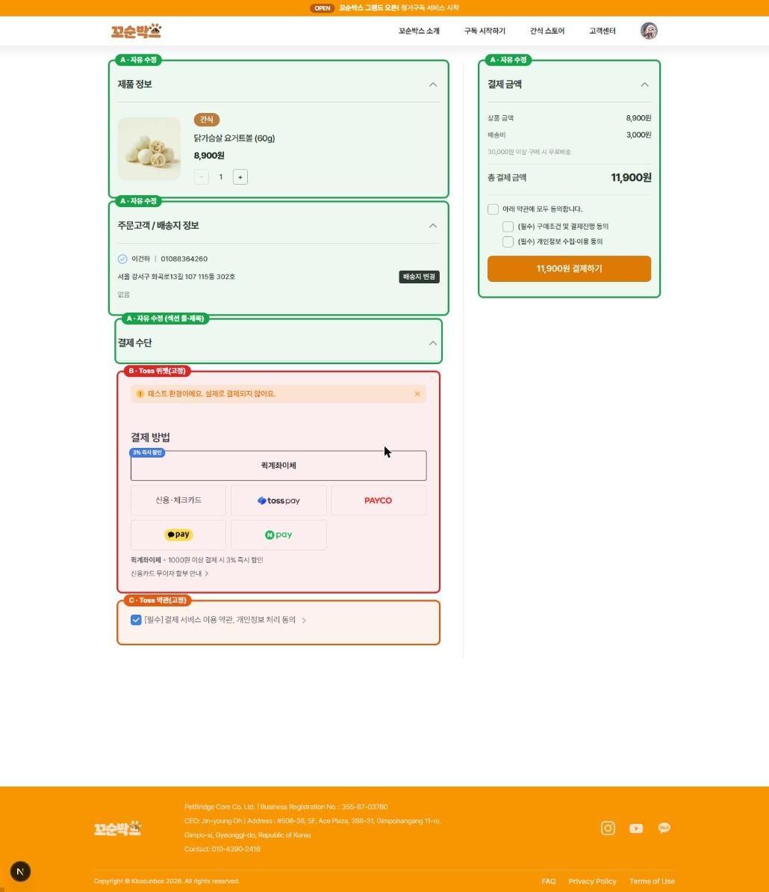
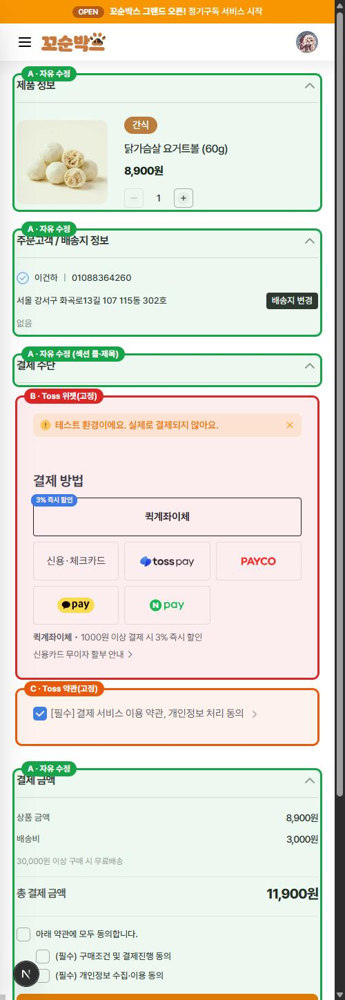

# 단건 결제(간식 스토어) 화면 — 수정 가능 영역 / 고정 영역

대상 화면: `/shop/order?productId=…` (간식 단건 구매)
작성일: 2026-07-28
공유 목적: 디자인 수정 범위 확인

---

## 한 줄 요약

주문 화면에서 **"결제 수단" 카드 안쪽만 토스 영역이고, 나머지는 전부 우리가 자유롭게 디자인할 수 있다.**
토스 영역은 iframe이라 우리 CSS가 닿지 않으며, 바꾸려면 코드가 아니라 **토스 상점관리자 설정**으로 바꾼다.

---

## 영역 구분 이미지

**데스크탑**



**모바일**



---

## 영역별 상세

| 구분 | 영역 | 어디까지 바꿀 수 있나 | 바꾸는 방법 |
|---|---|---|---|
| **A** (초록) | 제품 정보 / 주문고객·배송지 정보 / 결제 금액 / "결제 수단" 섹션 틀·제목 | **100% 자유** — 레이아웃, 여백, 폰트, 색, 문구, 버튼 모양, 요소 추가·삭제 전부 가능 | 우리 코드 수정 |
| **B** (빨강) | 결제수단 선택 위젯 (결제 방법 목록, 카드사·간편결제 로고, 할부 안내, 프로모션 문구, "테스트 환경이에요" 배너) | **우리 CSS로는 불가.** 단, 결제수단 종류·순서·2열/3열 레이아웃·강조·색상 등은 토스 설정으로 변경 가능 | 토스 상점관리자 > 결제위젯 > 결제 UI 설정 |
| **C** (주황) | 결제 서비스 이용약관 동의 체크박스 | **우리 CSS로는 불가.** 약관 문구·다국어는 토스 설정 | 토스 상점관리자 > 약관 설정 |
| **D** | (화면에 없음) 카드사 인증 창 | 전혀 불가 | 불가 |

### A — 자유 수정 영역

파일: `widgets/shop/ui/ShopOrderSection.tsx`

| 영역 | 코드 위치 |
|---|---|
| 제품 정보 카드 (이미지·카테고리 뱃지·상품명·가격·수량 조절) | `ShopOrderSection.tsx:181-237` |
| 주문고객 / 배송지 정보 | `ShopOrderSection.tsx:239-249` (`CheckoutAddressSection`) |
| "결제 수단" 섹션의 제목·접기 버튼·카드 틀 | `ShopOrderSection.tsx:251` (`SectionCard`) |
| 결제 금액 (상품 금액·배송비·총 결제 금액) | `ShopOrderSection.tsx:268-290` |
| **우리 약관 동의 체크박스 3개** | `ShopOrderSection.tsx:292-306` |
| 최종 "N원 결제하기" 버튼 | `ShopOrderSection.tsx:314-321` |

> **참고 — 약관 동의가 두 군데 있다.**
> 우측 "결제 금액" 카드 안의 체크박스 3개(구매조건·개인정보)는 **우리가 만든 것**이라 자유 수정 가능하고,
> 좌측 하단 C 영역의 "[필수] 결제 서비스 이용 약관, 개인정보 처리 동의"는 **토스가 그리는 것**이라 수정 불가다.
> 둘을 하나로 합치는 건 불가능하고, 배치를 바꾸는 정도만 가능하다.

### B·C — 토스 위젯 영역 (고정)

파일: `widgets/shop/ui/ShopOrderSection.tsx:253-254`

```tsx
<div id="shop-payment-widget" />      {/* B — 결제수단 선택 */}
<div id="shop-payment-agreement" />   {/* C — 약관 동의 */}
```

렌더 호출 (`ShopOrderSection.tsx:90-95`):
```ts
paymentWidget.renderPaymentMethods("#shop-payment-widget", { value: total }, { variantKey: "DEFAULT" });
paymentWidget.renderAgreement("#shop-payment-agreement", { variantKey: "AGREEMENT" });
```

**실제 DOM 확인 결과** (2026-07-28, 브라우저에서 직접 확인):

```
#shop-payment-widget    > div.__tosspayments_payment_widget_iframe_v2_wrapper__ > iframe
#shop-payment-agreement > div.__tosspayments_payment_widget_iframe_v2_wrapper__ > iframe
```

두 영역 모두 **다른 출처(cross-origin)의 iframe**이다. 즉:

- 우리 CSS/Tailwind 클래스가 iframe 내부에 전혀 적용되지 않는다 (브라우저 보안 정책)
- 내부 요소의 위치·크기·색·폰트·문구를 코드로 건드릴 수 없다
- 우리가 통제할 수 있는 건 **iframe 바깥의 배치뿐** — 위아래 여백, 좌우 폭, 섹션 안에서의 순서

### D — 토스 상점관리자에서 바꿀 수 있는 것

B 영역의 내용물은 코드가 아니라 토스 어드민 설정으로 바뀐다. 확인된 설정 항목:

- **결제 UI 생성/관리** — 여러 벌의 UI를 만들고 `variantKey`로 구분해 코드에서 골라 쓴다
- **디자인** — 결제수단 레이아웃(2열/3열), 카드사 레이아웃, 색상, 최상단 강조
- **기능** — 노출할 결제수단 선택 및 순서, 카드사 목록, 가상계좌, 프로모션
- **약관** — C 영역 문구, 다국어 약관

즉 "간편결제를 앞으로 빼달라", "카드사 목록을 2열로", "위젯 색을 브랜드 색으로" 같은 요청은
**개발 작업이 아니라 토스 상점관리자 설정 변경**으로 처리한다.

---

## 중요 — 지금 화면은 최종본이 아니다

현재 결제위젯은 **토스 공식 문서용 테스트 키**로 붙어 있다 (`ShopOrderSection.tsx:29-31`).

```ts
// 문서용 테스트 키 (Toss 결제위젯 SDK v1, 일반/단건 결제)
const WIDGET_CLIENT_KEY = "test_gck_docs_Ovk5rk1EwkEbP0W43n07xlzm";
```

그래서 지금 보이는 B 영역의 내용 — **퀵계좌이체 3% 즉시 할인, 결제수단 6종 구성, "테스트 환경이에요" 배너** —
는 전부 **토스 문서용 테스트 상점의 설정**이지 꼬순박스 설정이 아니다.
우리 상점 키로 교체하면 이 목록과 프로모션은 꼬순박스 상점관리자 설정대로 바뀐다.

**따라서 B 영역 디자인을 지금 화면 기준으로 확정하지 말 것.** 실키 연동 후 다시 확인해야 한다.

---

## 디자인 요청 시 판단 기준

| 요청 | 처리 |
|---|---|
| "상품 카드 여백을 줄여주세요" | A — 개발 작업 |
| "결제하기 버튼 색을 바꿔주세요" | A — 개발 작업 |
| "약관 동의 체크박스 스타일 바꿔주세요" | 우측 3개(A)는 가능 / 좌측 하단(C)은 불가 |
| "결제수단 아이콘 크기를 키워주세요" | B — 불가 (토스 고정) |
| "카카오페이를 맨 앞으로 빼주세요" | B/D — 토스 상점관리자 설정 |
| "결제수단을 2열로 보여주세요" | B/D — 토스 상점관리자 설정 |
| "결제수단 영역 전체를 오른쪽 칼럼으로 옮겨주세요" | A — 가능 (iframe 바깥 배치는 자유) |

---

## 출처

- [결제위젯 어드민 설정하기 — 토스페이먼츠 개발자센터](https://docs.tosspayments.com/guides/v2/payment-widget/admin)
- [결제위젯 이해하기 — 토스페이먼츠 개발자센터](https://docs.tosspayments.com/guides/v2/payment-widget)
- [상점관리자 — 토스페이먼츠 개발자센터](https://docs.tosspayments.com/resources/glossary/dashboard)
- DOM 구조는 2026-07-28 로컬 실행 화면에서 직접 확인
