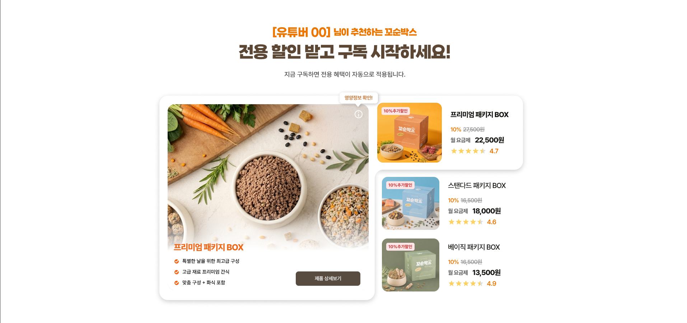

# Task: ReferralPackagePlansSection 구현

## 목적

`/ref/[slug]` 레퍼럴 랜딩 페이지에서 현재 사용 중인 일반 `PackagePlansSection` 대신,
인플루언서 이름과 레퍼럴 전용 할인 정보를 표시하는 **별도 섹션 위젯**을 구현한다.

## 레퍼런스 디자인



경로: `.claude/assets/screenshots/image-062.png`

## 위치 및 파일 구조

```
widgets/home/referral-package-plans/
├── index.ts
└── ui/
    └── ReferralPackagePlansSection.tsx
```

## 섹션 레이아웃 (데스크탑 기준)

### 헤더 (섹션 상단, 중앙 정렬)

```
[{influencerName}] 님이 추천하는 꼬순박스        ← 주황색(--color-accent-orange), 굵게, 작은 크기
전용 할인 받고 구독 시작하세요!                  ← 큰 볼드 타이틀(--color-brown-dark)
지금 구독하면 전용 혜택이 자동으로 적용됩니다.    ← 작은 서브텍스트(--color-text-warm)
```

- `influencerName`은 `useReferral()`에서 가져온다.

### 바디 (2컬럼, desktop lg+)

#### 왼쪽 컬럼 — 선택된 패키지 상세 카드

현재 `PackagePlansSection`의 `mobileSlot` 영역을 데스크탑에서도 보여주는 형태와 유사.
- 모서리가 둥근 카드(`rounded-[22px]`) 내부에 패키지 대표 이미지(정방형) 표시
- 이미지 위에 `PackageNutritionGuide` 버블 (`bubbleClassName="h-auto w-[100px]"`)
- 카드 하단:
  - 패키지 이름 (티어 색상)
  - 특징 3줄 목록 (CheckCircleIcon + 텍스트)
  - "제품 상세보기" 버튼 (dark warm 배경, rounded-[8px], 클릭 시 `/subscribe/detail?planId={plan.id}`)

#### 오른쪽 컬럼 — 패키지 목록 (3개, Premium → Standard → Basic 순)

각 항목 구조:
```
┌─────────────────────────────────────────────────┐
│ [티어색 배지 "N%추가할인"]  [패키지 썸네일 이미지] │
│                             패키지 이름           │
│                             N%  [원가]원          │  ← 원가 strikethrough
│                             월 요금제  [최종가]원  │
│                             ★★★★☆  N.N          │  ← 정적 평점 (아래 참고)
└─────────────────────────────────────────────────┘
```

- 항목 클릭 → 해당 패키지 선택 (왼쪽 카드 갱신)
- 현재 선택된 항목은 강조(테두리 또는 배경 변화)
- 기본 선택: Premium

#### 할인 배지 색상

| 티어 | 배지 배경 | 텍스트 |
|------|-----------|--------|
| Premium | `var(--color-accent-orange)` | 흰색 |
| Standard | `var(--color-plus)` | 흰색 |
| Basic | `var(--color-basic)` | 흰색 |

#### 가격 표시

- **배지 퍼센트**: `useReferral().discountRate * 100` → "N%추가할인"
  - 예: `discountRate = 0.1` → "10%추가할인"
- **원가(strikethrough)**: `plan.originalPrice`
- **최종가**: 백엔드가 레퍼럴 할인을 반영한 `plan.monthlyPrice`를 내려주는지 확인 필요.
  - 내려주지 않는 경우: `Math.round(plan.monthlyPrice * (1 - referralDiscountRate))`로 클라이언트 계산
  - **백엔드 확인 후 결정. 추측하여 구현하지 않는다.**

#### 별점 (정적 플레이스홀더)

평점 API가 없으므로 `PACKAGES` 데이터에 티어별 평점을 추가하거나 컴포넌트 내 상수로 관리.

```ts
const TIER_RATINGS: Record<PackageTier, number> = {
  Premium: 4.7,
  Standard: 4.6,
  Basic: 4.9,
};
```

별 아이콘: 기존 프로젝트에 StarIcon 등이 있으면 재사용, 없으면 SVG 인라인 또는 문자(★/☆)로 구현.

### 모바일 (< md, < 768px)

- 헤더 동일, 컬럼은 세로 스택
- 패키지 목록이 먼저(상단), 선택 상세 카드가 아래 — 또는 기존 `PlanTierDots` 패턴 활용 검토
- 정확한 모바일 레이아웃이 불확실하면 디자인 확인 후 구현

## 데이터 소스

```ts
// 플랜 목록: 기존 getSubscriptionPlans() 재사용
// 레퍼럴 정보: useReferral() — influencerName, discountRate
// 패키지 메타: PACKAGES (entities/package)
// 이미지: TIER_DETAIL_HERO_IMAGES (entities/package)
// 영양 정보 버블: PackageNutritionGuide (entities/package)
```

## 페이지 연동

`app/(main)/ref/[slug]/page.tsx`에서:
- 기존 `PackagePlansSection` import 제거
- `ReferralPackagePlansSection` import 추가

```tsx
// before
import { PackagePlansSection } from "@/widgets/home/package-plans";

// after
import { ReferralPackagePlansSection } from "@/widgets/home/referral-package-plans";
```

## 구현 전 확인 사항

1. 백엔드: 레퍼럴 랜딩에서 `getSubscriptionPlans()` 응답의 `monthlyPrice`가 레퍼럴 할인 적용가인지 여부
2. 별점 데이터 출처 — 현재는 정적 플레이스홀더로 진행

## 주의 사항

- 기존 `PackagePlansSection`, `PlanPicker`, `PlanTierDots`는 수정하지 않는다.
- 공용 컴포넌트 (`PACKAGES`, `TIER_DETAIL_HERO_IMAGES`, `PackageNutritionGuide`, `CheckCircleIcon`) 재사용 우선.
- 색상은 CSS 변수(`var(--color-*)`) 사용, hex 직접 사용 금지.
- 타이포그래피 클래스는 기존 globals.css 정의 재사용.
- 완료 후 `pnpm lint` + TypeScript 타입 검사 통과 확인.
