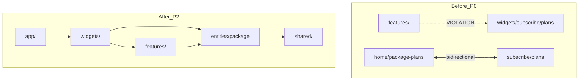

# Widgets 의존성 리팩터 종합 보고서

작성일: 2026-06-12  
진단 도구: `pnpm diagnose:widgets`, `pnpm depcruise`, `pnpm test:unit`, `tsc --noEmit`

---

## 1. Executive Summary

P0~P2까지 widgets 레이어 과의존·FSD 위반·교차 결합을 단계적으로 해소했습니다.

| 단계 | 핵심 성과 |
|------|-----------|
| **P0** | `packageData` → `entities/package` — features→widgets FSD 위반 **1건 → 0건** |
| **P1** | `order/lib` → `features/order`, 공유 package UI → `entities/package`, `usePlanRatings` → `features/review` |
| **P2** | `PackageNutritionGuide`·`PackageCompareTable` → `entities/package`, `OrderSection` 서브모듈 분리, mypage `dashboard-shared` → `lib/` |

**정량 변화 (초기 진단 → P2 완료)**

| 지표 | 초기 | P2 후 | 변화 |
|------|-----:|------:|------|
| `@/widgets` import lines | 110 | **65** | −41% |
| cross-widget importer files | 12 | **6** | −50% |
| FSD violations | 1 | **0** | 해소 |
| depcruise warnings | (미설치) | **5** | 의미 있는 결합만 |
| subscribe/plans fan-out | 40% | **32%** | −8%p |

---

## 2. 단계별 완료 내역

### P0 — `entities/package` 도메인 승격

- **이전:** `widgets/subscribe/plans/ui/packageData.ts` (10+ 소비자, features가 widgets import)
- **이후:** [`entities/package/lib/packageData.ts`](../entities/package/lib/packageData.ts)
- **효과:** `DeliveryStatusManager` 등 features 레이어가 entities만 참조

### P1-a — `features/order`

- [`features/order/lib/`](../features/order/lib/) — `orderPricing`, `inviteSectionMode`, `inviteValidation`
- [`OrderSection`](../widgets/order/ui/OrderSection.tsx), unit tests → `@/features/order`
- widgets/order/lib — deprecated re-export

### P1-b — 공유 package UI

| 모듈 | 새 위치 |
|------|---------|
| `PackageSummaryThumbnail`, `PlanRatingStars`, `useSvgBridge` | `entities/package/ui/` |
| `packageThumbnails`, `packageSummaryImages` | `entities/package/lib/` + `assets/` |
| `usePlanRatings` | `features/review/hooks/` |

**양방향 결합 해소:** `subscribe/plans` ↔ `home/package-plans` import **0건**

### P2-a — 영양정보·비교표

- [`entities/package/ui/PackageNutritionGuide.tsx`](../entities/package/ui/PackageNutritionGuide.tsx)
- [`entities/package/ui/PackageCompareTable.tsx`](../entities/package/ui/PackageCompareTable.tsx)
- home·checklist·subscribe 모두 `@/entities/package`에서 import
- `PackageDetailView` 중복 `PackageCompareTable` 정의 제거 (~200 LOC)

### P2-b — OrderSection 분리

[`widgets/order/ui/order-section/`](../widgets/order/ui/order-section/) 신설:

| 파일 | 역할 |
|------|------|
| `orderSectionStyles.ts` | input/action chip 클래스 |
| `orderSectionFormatters.ts` | 가격·전화번호 포맷 |
| `OrderSectionIcons.tsx` | 아이콘 컴포넌트 |
| `OrderSectionFormParts.tsx` | SectionCard, CollapsiblePanel, Checkbox 등 |

`OrderSection.tsx`: ~1,284 LOC → **~974 LOC** (비즈니스 로직·섹션 JSX는 유지, 추후 추가 분할 여지)

### P2-c — mypage dashboard-shared

- [`widgets/mypage/lib/dashboard-shared.tsx`](../widgets/mypage/lib/dashboard-shared.tsx) — UI 컴포넌트·상수
- `ui/dashboard-shared.tsx` — deprecated re-export
- 6개 카드/섹션 컴포넌트 import 경로 갱신

### 인프라

- [`scripts/diagnose-widgets-deps.mjs`](diagnose-widgets-deps.mjs) — 4축 자동 진단
- [`.dependency-cruiser.cjs`](../.dependency-cruiser.cjs) — FSD error + cross-slice warn
- `pnpm diagnose:widgets`, `pnpm depcruise` 스크립트

---

## 3. 잔량 (P3 이후 권장)

### 높은 우선순위

| 항목 | 현재 상태 | 권장 |
|------|-----------|------|
| **SubscriptionChangePlansSection** | `SubscribePlansSection` 전체 widget 재사용 + hero asset cross-import | props 기반 공통 `entities/package/ui/PlansPicker` 추출 또는 feature composition |
| **ProductSupportTab** | subscribe → support/faq | support 섹션을 shared/entities로 승격 또는 app 레벨 조립 |
| **forgot-password → register** | paw asset 1건 | `shared/assets` 또는 entities |

### 중간 우선순위

| 항목 | 비고 |
|------|------|
| `OrderSection.tsx` 잔여 ~974 LOC | 제품/배송/결제/초대/요약 섹션별 파일 분리 |
| `PackageDetailView.tsx` ~680 LOC | subscribe 전용 — entities와 역할 분리 유지 |
| deprecated re-export 파일 | 점진 삭제 (packageData, order/lib, widget thumbnails 등) |
| `entities/package/assets` vs widget assets | 중복 PNG 정리 (home/subscribe 원본 유지 vs entities 단일 소스) |

### 낮은 우선순위

- mypage God sections (`SubscriptionCard`, `SubscriptionDetailSection` 등) 추가 분할
- `app/(main)/layout.tsx`의 `ChecklistFormModal` deep import → barrel export
- CI에 `pnpm depcruise` 추가

---

## 4. 잔여 Cross-Widget 결합 (6 files)

```
mypage → subscribe/plans: 2  (SubscriptionChangePlansSection)
forgot-password → register: 1
inquiry → support/shared: 1
subscribe/plans → support/faq: 1
support/faq → support/shared: 1
support/inquiry-history → support/shared: 1
```

support 그룹 내부 결합(2건)은 동일 도메인 공유로 **허용** 수준.  
**mypage → subscribe/plans**가 유일한 cross-domain widget 결합.

---

## 5. 검증 결과

| 검사 | 결과 |
|------|------|
| `tsc --noEmit` | **통과** |
| `pnpm test:unit` | **29/29 통과** |
| `pnpm depcruise` | **0 errors**, 5 warnings |
| FSD violations | **0** |

### 알려진 기존 이슈 (이번 작업과 무관)

`pnpm lint` 실행 시 **기존부터 존재**하는 오류·경고가 있습니다:

- `PointHistorySection.tsx` — `react-hooks/set-state-in-effect` error
- 여러 mypage/order 파일 — `@next/next/no-img-element` warning
- `SupportSection.tsx` — unused `Image` import

이번 리팩터로 **새로 추가된 lint/tsc 오류는 없습니다.**

---

## 6. 아키텍처 변화 다이어그램



---

## 7. 재진단 명령어

```bash
pnpm diagnose:widgets          # Markdown 리포트 → scripts/reports/widgets-deps-latest.md
pnpm diagnose:widgets:json       # JSON 출력
pnpm depcruise                 # FSD + cross-slice 검증
pnpm test:unit
npx tsc --noEmit
```

---

## 8. 결론

- **우려했던 widgets 과의존은 구조적으로 개선됨** — 특히 subscribe/plans 허브화·FSD 위반·home↔subscribe 양방향 결합 해소.
- **핵심 도메인(package, order, review ratings)은 entities/features로 이전 완료.**
- **잔량은 주로 페이지 조립 패턴**(mypage가 subscribe 섹션 재사용, support 그룹 공유)이며, 기능 버그보다는 **추가 분리 작업** 성격.
- 정기적으로 `pnpm diagnose:widgets` + `pnpm depcruise`로 회귀 방지 권장.
